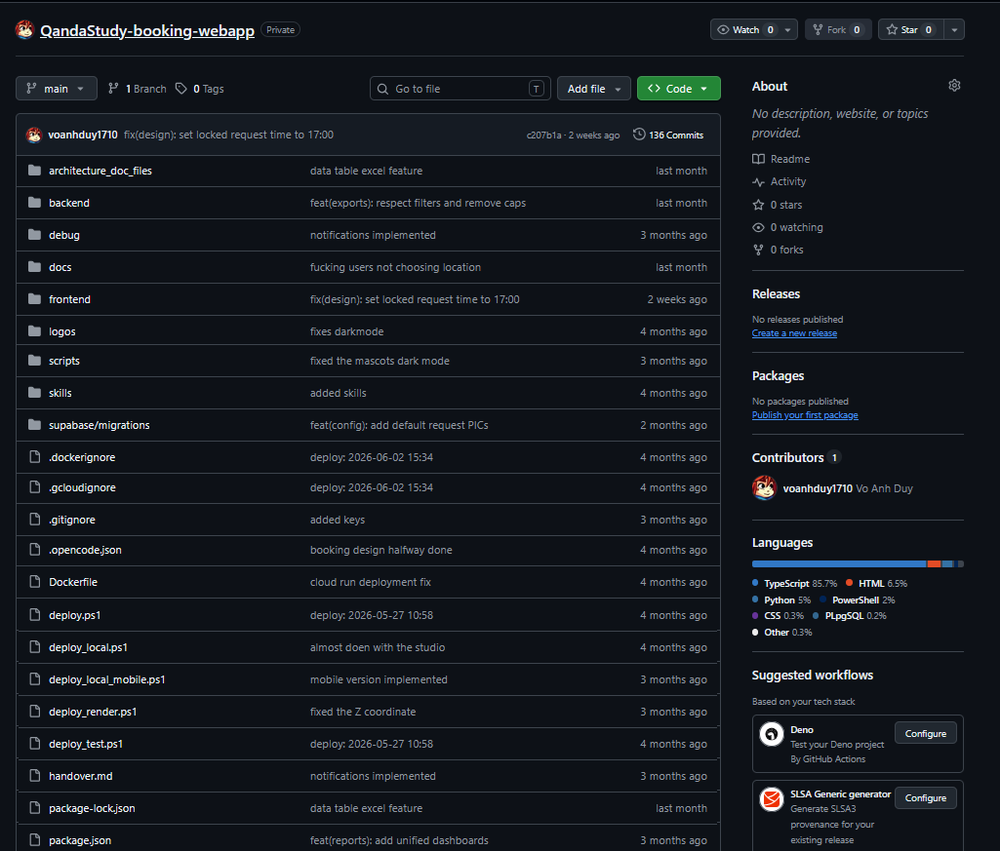
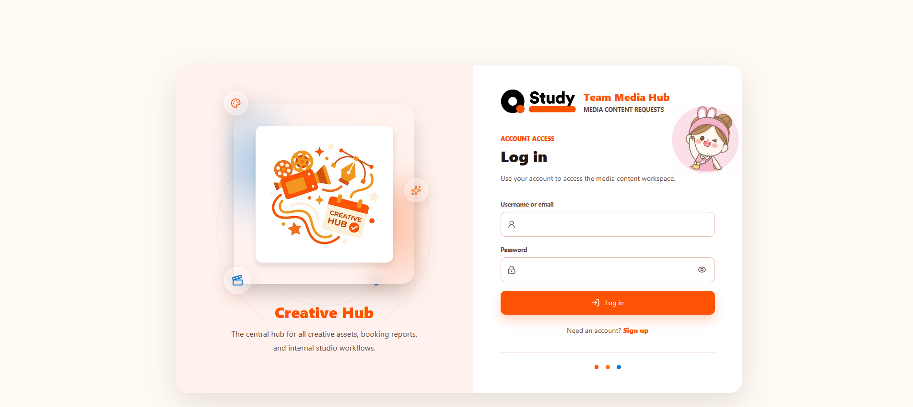
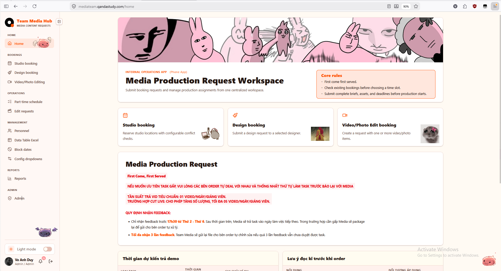
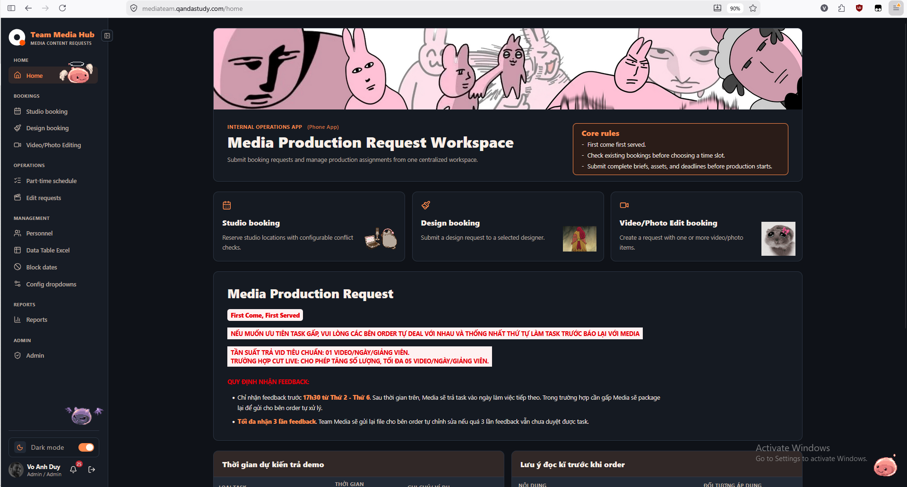
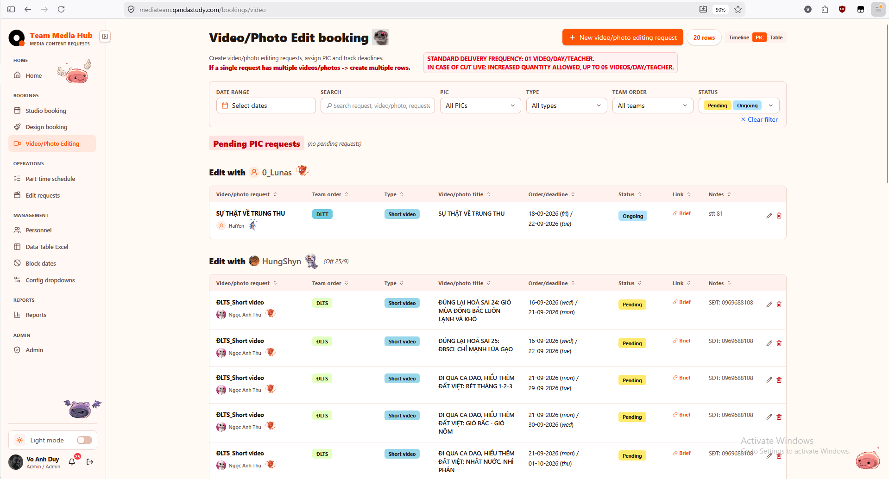
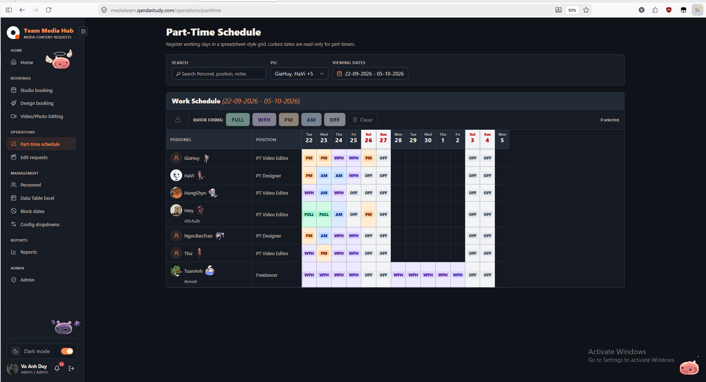
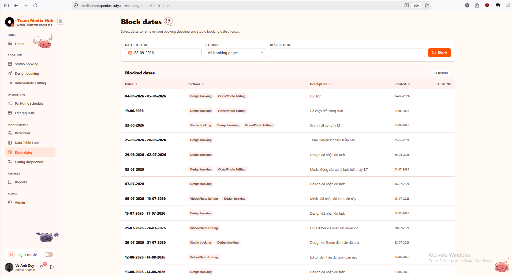

# QandaStudy Booking Web App

[](https://react.dev/)
[](https://nestjs.com/)
[](https://www.typescriptlang.org/)
[](https://tailwindcss.com/)
[](https://vitejs.dev/)
[](https://kysely.dev/)
[](https://supabase.com/)
[](https://swagger.io/)

A full-stack, real-time resource and space reservation management web application built with **React 19**, **Vite 8**, **Tailwind CSS v4**, and **NestJS 11**, powered by **Kysely** and **Supabase PostgreSQL** for scheduling study spaces, livestream rooms, studio facilities, and creative design services.

---

## Features

- **Interactive Studio & Room Booking Calendar**
- **Livestream Schedule & Equipment Management**
- **Design & Video Production Request Workflows**
- **Real-time Availability & Conflict Detection**
- **Automated Date Blocking & Holiday Management**
- **Part-time Staff Scheduling & Shift Rostering**
- **Role-Based Access Control (Admin, Staff, Student)**
- **Slack & Push Notification Event Triggers**
- **Comprehensive Space Utilization Reports & Statistics**
- **Mobile-Responsive UI with Dark & Light Theme Support**

---

## Preview















---

## Project Structure

```text
QandaStudy-booking-webapp/
├── frontend/                     # React 19 Client Application
│   ├── src/
│   │   ├── app/                  # Application layout, root shell & router config
│   │   ├── features/
│   │   │   ├── admin/            # Admin controls, system configurations & auditing
│   │   │   ├── auth/             # Login, authentication guards & profile sessions
│   │   │   ├── block-dates/      # Facility closure dates & holiday scheduling
│   │   │   ├── design-booking/   # Graphic design service requests & approvals
│   │   │   ├── edit-requests/    # Booking modification & cancellation workflows
│   │   │   ├── livestream/       # Livestream room allocation & equipment presets
│   │   │   ├── notifications/    # In-app alerts, activity log & push messaging
│   │   │   ├── parttime/         # Staff shift assignments & attendance tracking
│   │   │   ├── personnel/        # Team member directory & role assignments
│   │   │   ├── reports/          # Space utilization analytics & booking statistics
│   │   │   ├── studio-booking/   # Audio/video studio reservations & time slots
│   │   │   └── video-booking/    # Video shooting & editing schedule requests
│   │   ├── shared/               # Shared components, date pickers, modals & UI hooks
│   │   ├── index.css             # Tailwind CSS v4 design tokens & base rules
│   │   └── main.tsx              # Frontend bootstrap entry point
│   ├── package.json              # Frontend dependencies & scripts
│   └── vite.config.ts            # Vite 8 configuration
├── backend/                      # NestJS 11 Microservice Backend
│   ├── src/
│   │   ├── core/                 # Database connection, interceptors & auth guards
│   │   ├── features/
│   │   │   ├── accounts/         # User accounts & credentials service
│   │   │   ├── auth/             # JWT auth strategy & authentication modules
│   │   │   ├── blocked-dates/    # Blackout dates CRUD & validation logic
│   │   │   ├── design-booking/   # Design reservation domain logic & endpoints
│   │   │   ├── livestream/       # Livestream scheduling & conflict checks
│   │   │   ├── notifications/    # Notification dispatcher & email alerts
│   │   │   ├── parttime/         # Staff scheduling & roster management
│   │   │   ├── slack-notification/# Slack webhook integrations & event triggers
│   │   │   ├── studio-booking/   # Studio room calendar engine
│   │   │   └── video-booking/    # Video facility booking controllers & services
│   │   ├── integrations/         # Supabase & third-party API clients
│   │   └── main.ts               # NestJS bootstrap & Swagger OpenAPI setup
│   ├── package.json              # Backend dependencies & NestJS CLI scripts
│   └── tsconfig.json             # TypeScript compiler configuration
└── package.json                  # Root npm workspace configuration
```
