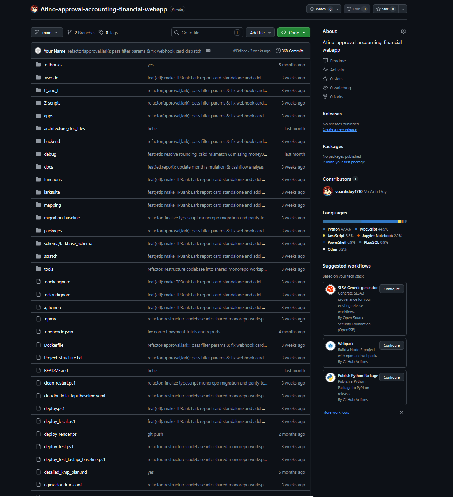
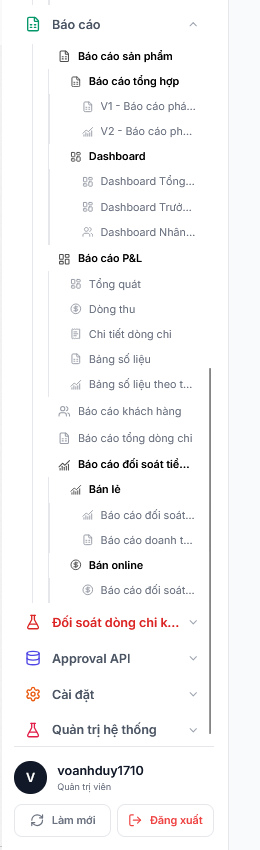
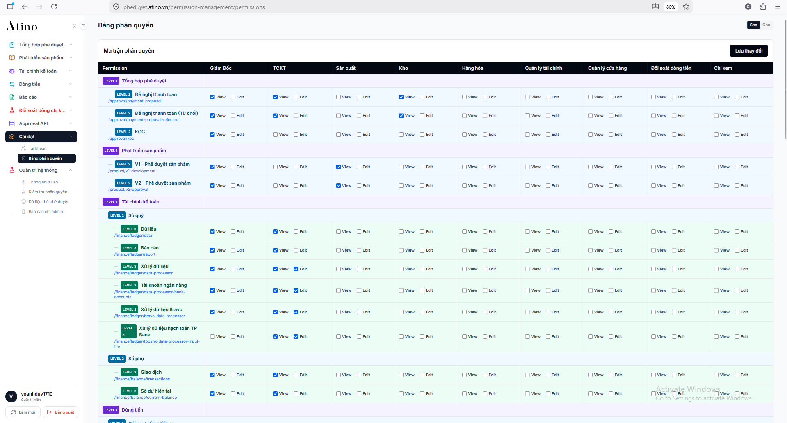

# Atino Tong Hop Approval Web

[](https://nodejs.org/)
[](https://react.dev/)
[](https://www.typescriptlang.org/)
[](https://tailwindcss.com/)
[](https://vitejs.dev/)
[](https://turbo.build/)
[](https://tanstack.com/query)
[](https://tanstack.com/table)

A modern, high-performance financial management and approval dashboard web application built with **React 19**, **TypeScript**, **Tailwind CSS**, and **Vite** within a **Turborepo** monorepo, integrated with **TanStack Query** and **TanStack Table** for real-time ledger reconciliation, multi-tier approvals, cash flow analytics, and granular role-based access control.

---

## Features

- **Multi-tier Approval Workflow & Live Status Tracking**
- **Approval API Testing, Inspection & Payload Preview**
- **General Ledger Accounting & Automated Balance Reconciliation**
- **Cash Outflow Analytics & Category Expense Tracking**
- **Cash Inflow Auditing & Receipt Pipeline Management**
- **Executive KPI Dashboard & Real-time Financial Metrics**
- **Product Performance, Margin Analysis & SKU Profitability**
- **KOC Chat & Team Collaboration Workspace**
- **Granular Role-Based Access Control (RBAC) & Permissions**
- **High-fidelity Excel & Styled PDF Report Exports**

---

## Preview








---

## Project Structure

```text
Atino-tong-hop-approval-web/
├── apps/
│   ├── web/                      # Core React 19 web application
│   │   ├── src/
│   │   │   ├── app/              # Root App, routing configuration & layout wrappers
│   │   │   ├── assets/           # Static icons & UI graphics
│   │   │   ├── features/
│   │   │   │   ├── admin/        # Admin management & system configuration
│   │   │   │   ├── approval-api-preview/ # API endpoint testing & payload debugger
│   │   │   │   ├── approval-summary/     # Approval status tracking & filter tables
│   │   │   │   ├── auth/         # Authentication provider & session guards
│   │   │   │   ├── balance-summary/      # Balance position & account reconciliations
│   │   │   │   ├── cashflow/     # Cash outflow, expense logs & category breakdowns
│   │   │   │   ├── cashflow-in/  # Cash inflow, revenue pipelines & receipt audits
│   │   │   │   ├── dashboard/    # Executive KPI metrics, summary charts & widgets
│   │   │   │   ├── koc-chat/     # Internal communication & real-time messaging
│   │   │   │   ├── ledger/       # General ledger records, entries & discrepancies
│   │   │   │   ├── permission-management/ # User roles, permissions & access policies
│   │   │   │   ├── product-dashboard/    # SKU margins, product sales & inventory KPIs
│   │   │   │   └── report/       # Exportable financial statements & audit reports
│   │   │   ├── shared/           # Reusable UI components, hooks & table primitives
│   │   │   ├── index.css         # Global Tailwind CSS styles and theme variables
│   │   │   └── main.tsx          # Frontend entry point
│   │   ├── package.json          # Web app dependencies & Vite build scripts
│   │   └── vite.config.ts        # Vite build & proxy configuration
│   └── mobile/                   # Mobile-optimized client application
├── packages/                     # Shared monorepo packages & common types
├── public/                       # Public static assets & preview images
├── turbo.json                    # Turborepo task pipeline orchestration
└── package.json                  # Root monorepo workspace configuration
```
