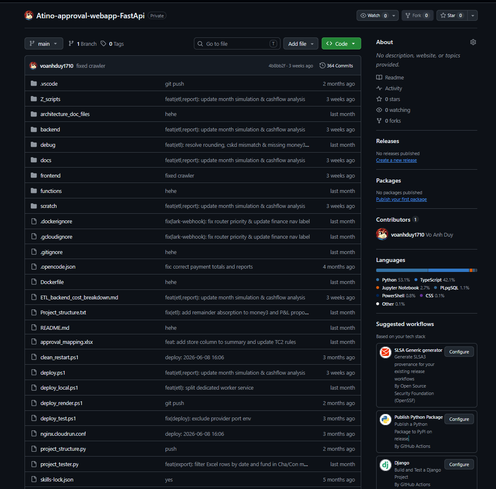

# Atino Approval Webapp FastAPI

[](https://www.python.org/)
[](https://fastapi.tiangolo.com/)
[](https://www.uvicorn.org/)
[](https://supabase.com/)
[](https://cloud.google.com/bigquery)
[](https://docs.pydantic.dev/)
[](https://www.docker.com/)

A high-throughput, enterprise-grade RESTful API and background worker microservice built with **FastAPI**, **Uvicorn**, and **Pydantic v2**, orchestrating complex financial approvals, **Google Cloud BigQuery** data warehousing, **Supabase PostgreSQL** real-time persistence, and automated **LarkSuite Webhook** integrations.

> [!NOTE]
> **Architecture & Refactoring Context:**
> This project is the original foundation of the [Atino Tong Hop Approval Web](../2.%20Atino-tong-hop-approval-web). In the beginning, the application and its backend services were built in **Python with FastAPI**. To unify the type system, streamline developer velocity, and support the web/mobile monorepo ecosystem, the system was later refactored to **TypeScript**. This repository documents the original FastAPI microservice design, endpoints, and data processing workflows.

---

## Features

- **High-performance Asynchronous RESTful Endpoints**
- **Automated LarkSuite / Feishu Approval Webhook Ingestion**
- **ETL Worker Pipeline, Periodic Syncs & Background Batch Jobs**
- **BigQuery Data Warehouse Streaming & Extraction**
- **Supabase PostgreSQL Real-time Persistence & Query Pooling**
- **JWT Authentication & Granular RBAC Permission Verification**
- **SlowAPI Rate Limiting & Anti-Abuse Protection**
- **Automated General Ledger Balancing & Reconciliation Engine**
- **Comprehensive Request Correlation ID & Structured Logging**
- **Containerized Deployment for Google Cloud Run with Auto-scaling**

---

## Preview



---

## Project Structure

```text
Atino-approval-webapp-FastApi/
├── app/
│   ├── core/                     # Application settings, DB connections, exceptions & filters
│   │   ├── config.py             # Environment configurations & secret management
│   │   ├── database.py           # Supabase & PostgreSQL client connection poolers
│   │   ├── exceptions.py         # Global error handlers and standardized responses
│   │   └── logging_filters.py    # Structured logging & proxy access log filters
│   ├── features/
│   │   ├── approval/             # Approval ticket processing & validation logic
│   │   ├── approval_api_preview/ # Endpoint mocks & debug inspection utilities
│   │   ├── auth/                 # JWT validation, password hashing & auth dependencies
│   │   ├── balance/              # Balance calculations & bank account reconciliation
│   │   ├── cashflow/             # Cash outflow auditing & expense aggregation
│   │   ├── cashflow_in/          # Inbound payment verification & invoice matching
│   │   ├── dashboard/            # High-speed cached metric aggregation endpoints
│   │   ├── etl/                  # ETL pipeline runners, sync workers & batch jobs
│   │   ├── koc_chat/             # Real-time discussion & notification endpoints
│   │   ├── lark_webhook/         # Lark / Feishu interactive webhook listeners
│   │   ├── ledger/               # Ledger journal entry indexing & balance checking
│   │   ├── permissions/          # Granular role & permission verification hooks
│   │   └── report/               # Analytical queries & data export generation
│   ├── integrations/             # External SDKs (BigQuery, Google Sheets, LarkSuite)
│   ├── models/                   # Pydantic schemas & database transfer models
│   └── main.py                   # FastAPI app instance, lifespan & router mounts
├── tests/                        # Unit tests & integration test suites
├── Dockerfile                    # Containerization for Google Cloud Run
└── requirements.txt              # Production Python dependencies
```
