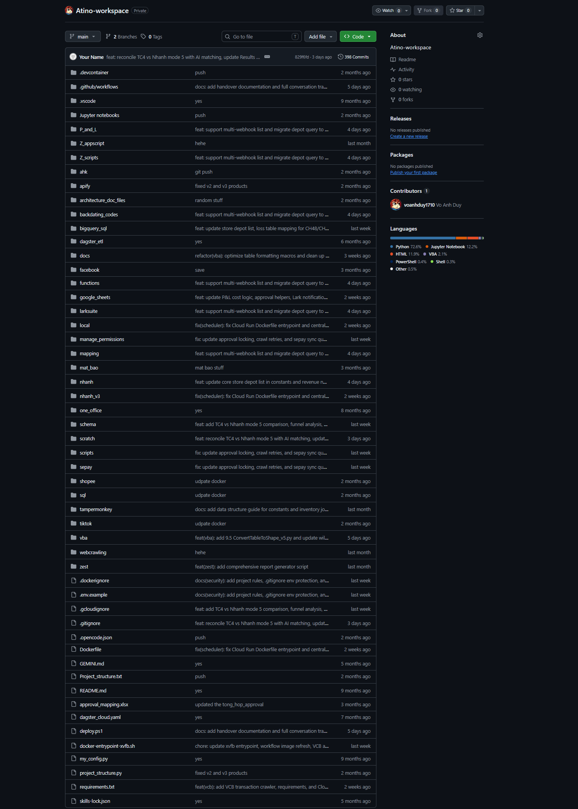

# Atino Workspace

[](https://www.python.org/)
[](https://dagster.io/)
[](https://cloud.google.com/bigquery)
[](https://supabase.com/)
[](https://pandas.pydata.org/)
[](https://www.selenium.dev/)
[](https://www.docker.com/)

An enterprise data platform and automation workspace built in **Python**, utilizing **Dagster** for workflow orchestration, **Google Cloud BigQuery** for analytical data warehousing, and **Supabase PostgreSQL** for operational data stores, integrating multi-channel e-commerce APIs, financial ledger backdating, and automated headless web scraping.

---

## Features

- **Dagster Orchestrated Data Pipelines & Cloud Schedules**
- **Multi-Platform E-commerce ETL (Shopee, TikTok Shop, Nhanh.vn)**
- **Automated Financial P&L & Balance Sheet Computations**
- **General Ledger Backdating & Discrepancy Reconciliation**
- **LarkSuite / Feishu Approval Automation & Bitable Sync**
- **OneOffice ERP Approval & Attendance Integrations**
- **Google Sheets Automated Two-way Synchronization**
- **Headless Browser Scraping via Selenium & Undetected Chromedriver**
- **Banking & Payment Webhook Ingestion (Sepay)**
- **Dockerized Runtime with Virtual Framebuffer (Xvfb) for Browser Automation**

---

## Preview



---

## Project Structure

```text
Atino-workspace-duy/
├── backdating_codes/             # Historical financial ledger backdating & recomputation
├── bigquery_sql/                 # Production SQL models & BigQuery data pipelines
├── dagster_etl/                  # Dagster asset definitions, jobs & cloud schedules
├── functions/                    # Core business logic, Supabase loaders & helper routines
├── google_sheets/                # Google Sheets API synchronization & formatting scripts
├── larksuite/                    # Lark / Feishu Open API integrations & approval exports
├── mapping/                      # Chart of accounts, category & store mapping dictionaries
├── nhanh_v3/                     # Nhanh.vn retail ERP API sync (orders, customers, stock)
├── one_office/                   # OneOffice HRM/ERP approval & timekeeping extractors
├── P_and_L/                      # Profit and Loss reporting engines & aggregation rules
├── sepay/                        # Real-time bank transaction webhook handlers
├── shopee/                       # Shopee Open Platform orders & financial data sync
├── tiktok/                       # TikTok Shop seller API pipelines & payout reconciliations
├── webcrawling/                  # Selenium, Apify & stealth scraping modules
├── Dockerfile                    # Container definition with Xvfb headless display
└── requirements.txt              # Data platform dependencies
```
